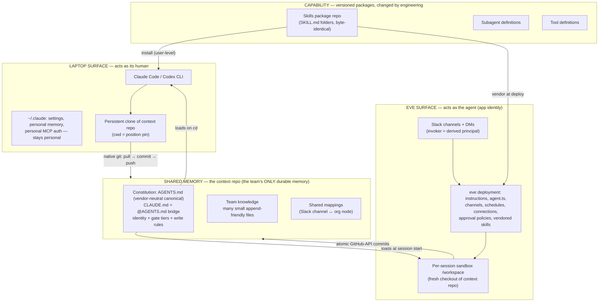
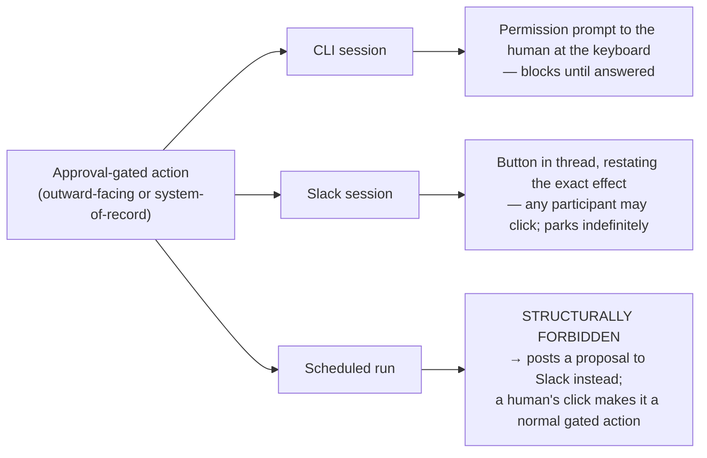
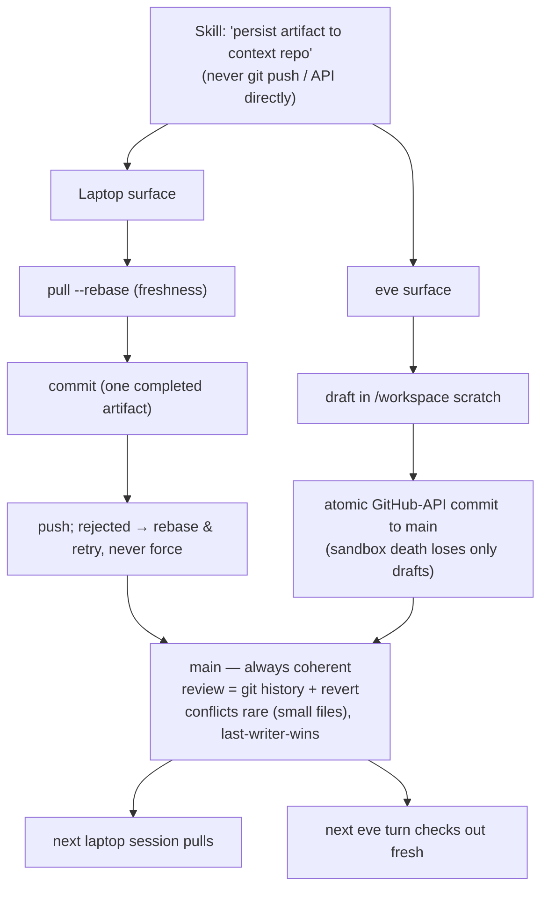
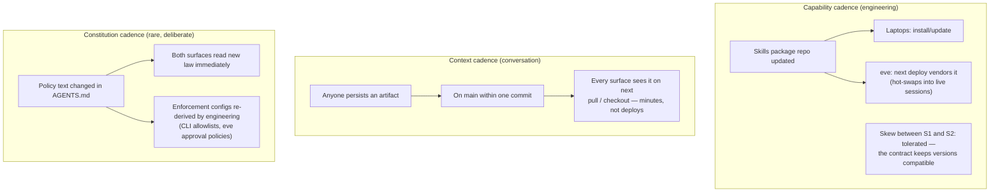

# The Two-Surface Concept Map

**One company brain, two bodies.** The same capabilities serve individual humans in their desktop/CLI agents (Claude Code, Codex) and the whole team through Vercel eve agents in Slack. This document is the one picture: every concept from both ecosystems, where it lives, who defines it, and how the surfaces stay consistent.

*Why eve as the team surface (and not Claude Code's own cloud siblings — environments, routines, channels): eve is chat-native, durable-by-default, and channel-plural by design; the CLI's cloud features extend one person's coding sessions, while eve is built to be a standing teammate. Both worlds share the SKILL.md standard, so the choice costs no skill portability.*

---

## The five decisions everything rests on

1. **Identity: the surface is the boundary.** Laptop always acts as its human. eve always acts as the agent's own app identity (v1) — person-voiced actions (email-as-me) are laptop-only; eve skills refuse-and-redirect.
2. **Approvals: three tiers by reversibility and audience.** Free (reads) / repo-gated (context-repo writes — the write path is the review) / approval-gated (outward-facing or system-of-record mutations — always a human click, rendered natively per surface). Schedules may never perform gated actions; they post proposals.
3. **Writes: direct to main, surface-supplied mechanism.** Humans use native git; eve uses atomic GitHub-API commits (never `git push` from the sandbox). Pull before durable writes; one commit per completed artifact; main is always coherent.
4. **Four realms by change-agent and lifetime.** Capability (versioned packages, engineering cadence) / shared memory (the context repo — the team's only durable memory) / actor state (credentials only; position and identity always derived) / session (scratch dies unless explicitly persisted). Two laws: *"if it's not in the context repo, the team doesn't know it"* and *secrets never enter the repo, even gitignored*.
5. **Skills: byte-identical under a seven-clause contract.** One skill folder, installed on laptops, vendored into eve. No keyboard assumptions · capabilities not credentials · identity awareness · declared gate tiers · abstract "persist artifact" writes · location-derived position · scratch is scratch. Non-conforming skills are *scoped* (laptop-only / eve-only), never adapted.

**Standing principle — general agent first, vendor second.** Every canonical artifact takes the vendor-neutral form; vendor-specific files are bridges or renderings, never the source of truth. Instructions: `AGENTS.md` is the content — `CLAUDE.md` contains exactly `@AGENTS.md` (Claude Code's bridge; Codex reads `AGENTS.md` natively). Skills: the cross-vendor SKILL.md standard, not any vendor's extensions. The same bridge pattern applies to any future multi-vendor surface: neutral canonical file, thin per-vendor pointer.

---

## The one picture: where everything lives

---

## Master table

**Column key — Home:** `capability` = skills package repo / eve deployment / user install · `context repo` = shared memory · `machine` = personal, one actor · `session` = dies with the conversation · `won't use` = explicitly not used on that surface.

### Group 1 — Brains: instructions and knowledge

| Concept | What it is | Laptop | eve | Counterpart & home |
|---|---|---|---|---|
| **eve `instructions.md`** | Always-on system prompt; the agent's permanent identity | — | Deployment (required file) | ↔ AGENTS.md (+ vendor bridges). **Home: eve deployment**, kept thin — identity + "read the constitution from the context repo"; company knowledge never hardcoded here |
| **AGENTS.md** (canonical) **+ CLAUDE.md bridge** | Persistent instructions loaded into context | Repo-root files load on `cd`; personal instruction files stay personal | Read from checked-out context repo | ↔ instructions. **Home: context repo** — root `AGENTS.md` *is* the constitution (vendor-neutral, Codex-native); `CLAUDE.md` contains exactly `@AGENTS.md` so Claude Code reads the same law. Personal instruction files (`~/.claude/CLAUDE.md`, `~/.codex/AGENTS.md`) stay machine |
| **Rules directories** (`.claude/rules/` etc.) | Modular, path-scoped instruction files — a vendor-specific mechanism | Loads from repo clone (Claude Code only) | Loads from checkout | Vendor rendering, not canonical. Team rules belong in the neutral `AGENTS.md` structure; use a vendor rules dir only for content that is genuinely vendor-specific. **Home: context repo**; personal rules stay machine |
| **Auto memory** (`~/.claude/projects/…/memory/`) | Notes the CLI agent writes itself, per repo, per machine | Machine-local | No equivalent (eve has **no memory primitive**) | Asymmetric. Personal observations: **machine**. Anything the team should know: promoted to **context repo** via a normal persist-artifact write — *"not in the repo = the team doesn't know it"* |
| **eve durable state** (`defineState`) | Typed per-**session** memory slots | — | Session realm | ↔ in-conversation scratch. **Home: session.** Never a durable store — durable facts go to the context repo |

### Group 2 — Capabilities: skills, tools, subagents, plugins

| Concept | What it is | Laptop | eve | Counterpart & home |
|---|---|---|---|---|
| **Skills** (SKILL.md) | Model-loadable procedures; same open standard on all three runtimes (Claude `/name`, Codex `$name`, eve `load_skill`) | User-level install from skills package repo | Vendored into deployment at deploy | **Identical concept, byte-identical artifact.** Home: **capability** (one canonical skills package repo). Never in the context repo. Version skew tolerated — the contract keeps versions behaviorally compatible |
| **Slash commands** | Officially merged into skills | (same as skills) | (same) | Row collapsed into Skills |
| **Tools** (eve `defineTool` / CLI built-ins) | Typed actions the model calls | CLI built-ins + MCP tools | Deployment `tools/*.ts` + harness built-ins | Rough counterparts. **Home: capability** (deployment / CLI itself). Skills name *capabilities*, never specific tool plumbing |
| **Subagents** | Specialist child agents with isolated context | Project dirs (`.claude/agents/`, `.codex/agents/`) or user dirs | `agent/subagents/` in deployment | **Identical concept.** Home: **capability** — shipped alongside the skills they serve; team subagents in the package (neutral definitions where the vendors' formats allow), personal ones stay machine |
| **eve extensions / CLI plugins** | Packaged bundles of skills+tools+connections (npm mounts / marketplace plugins) | Plugins via marketplaces | Extensions via npm mounts | **Same idea, different packaging.** Home: **capability**. Use only if the skills package outgrows plain folders — not load-bearing in v1 |
| **Plugin marketplaces** | Catalogs for plugin discovery/pinning | Optional distribution channel | eve registries (`eve add`) | **Home: capability-distribution machinery.** The canonical channel is the skills package repo itself; marketplaces optional convenience |
| **eve harness** | Built-in agent loop: 13 tools, compaction | ↔ the CLI's own loop + built-in tools | Framework-provided | Direct counterpart. **Home: the platform itself** — never referenced by skills |
| **eve evals** | Scored regression checks against real agent runs | No native equivalent (ad-hoc skill evals) | `evals/` beside deployment | Asymmetric. **Home: capability** (CI of the skills/deployment repos). Laptop: won't use |

### Group 3 — Reaching the world: credentials and integrations

| Concept | What it is | Laptop | eve | Counterpart & home |
|---|---|---|---|---|
| **MCP servers** | External tool/data connections | `.mcp.json` (project) / `~/.claude.json` (user) — **personal auth, acts as the human** | Via eve connections | ↔ connections. Laptop home: **machine** (each person's own MCP auth). Team-shared server *lists* may live in the skills package; auth never shared |
| **eve connections / Vercel Connect** | MCP + OpenAPI bridges with brokered auth; token never reaches model or sandbox | — | Deployment `connections/*.ts`, all `principalType: "app"` (v1) | ↔ MCP config. **Home: eve deployment.** The identity decision lives here: app-scoped only; per-user OAuth is the recorded upgrade path |
| **Secrets** | API keys, tokens, credentials | Keychain/env — **the only actor state** | Vercel env vars + Connect encrypted storage | **Never in the context repo, even gitignored.** Safe labels only |
| **AI Gateway** | Model routing + fallbacks via Vercel OIDC | Won't use (CLI hits provider directly with personal auth) | All deployment model calls | No laptop counterpart. **Home: platform (eve side)** |
| **eve observability** (Agent Runs) | Zero-config run dashboard + OTEL | ↔ local transcripts/logs (machine) | Per-project dashboard | Asymmetric, both fine. **Home: platform.** Not the team's memory — conclusions worth keeping get persisted to the repo |

### Group 4 — Surfaces and entry points

| Concept | What it is | Laptop | eve | Counterpart & home |
|---|---|---|---|---|
| **The CLI itself** | The engine + TUI on a person's machine | Per-machine install, personal auth | ↔ the deployment as a whole | The two surface shells. **Home: machine** (CLI) / **capability** (deployment) |
| **eve channels** | Entry points (Slack, HTTP, …) normalizing platform input into sessions | The terminal *is* the one hardcoded channel | Deployment `channels/*.ts` — Slack is the v1 surface | **Home: eve deployment.** CLI: no counterpart needed |
| **eve schedules** | Cron-triggered sessions (app principal, cannot park for approval) | Won't use CLI routines/scheduled tasks for team work | Deployment `schedules/*.ts` | **Home: eve deployment — the only scheduler.** Bound by gate policy: free + repo-gated work only; outward actions become Slack proposals |
| **CLI cloud siblings** (environments, routines, Cowork, channels) | Claude Code's own cloud offering | **Won't use for the team surface** | — | eve is the team surface, deliberately (see header). Individuals may still use them personally — but nothing team-shared may live there |
| **Headless `-p` / Agent SDK** | Non-interactive CLI invocation | Personal automation only | Not needed (eve is headless by nature) | **Home: machine, personal.** Team automation belongs to eve schedules |
| **eve sessions/turns/steps** | Durable conversation containers, checkpointed, resumable | ↔ CLI sessions, `--resume`, checkpointing (machine-local) | Platform runtime | Counterparts. **Home: session realm** both sides; transcripts are not team memory |
| **eve sandbox** (`/workspace`) | Per-session isolated filesystem; fresh context-repo checkout | ↔ the local working dir + Bash sandbox | Platform-provided | Counterparts. **Home: session.** The laptop's *clone* is durable but its uncommitted state is still session-realm: unpushed = the team doesn't know it |

### Group 5 — Control: permissions, gates, hooks, config

| Concept | What it is | Laptop | eve | Counterpart & home |
|---|---|---|---|---|
| **eve HITL approvals** | Per-tool gates; sessions park durably; Slack buttons | ↔ permission prompts | Deployment approval policies | **One policy (the three tiers, canonical in the constitution), two native renderings.** Enforcement configs: capability realm, derived from the constitution |
| **CLI permission rules & modes** | allow/ask/deny rules, permission modes | Settings files; outward-facing tools **never allowlisted** | ↔ approval policies | Same as above — the laptop rendering of the tiers |
| **CLI hooks** (blocking, ~30 events) | Deterministic handlers that can block/mutate | Personal convenience only (machine) | **No counterpart** — eve hooks are observe-only; Codex has none | **Never policy carriers.** Cross-surface policy lives in the constitution + gate configs |
| **eve hooks** (observe-only) | Post-hoc event listeners (audit, metrics) | — | Deployment | Optional plumbing. **Home: eve deployment** |
| **Settings** (`settings.json` / `config.toml` / `agent.ts`) | Runtime config: model, env, permissions | User + project scopes | `agent.ts` + env | Counterparts. Machine (personal) / capability (team enforcement configs). Never in the context repo |
| **Output styles** | System-prompt tone/format modifiers | Personal taste (machine) | **Won't use** | CLI-only comfort; never carries policy |
| **Status line / keybindings / TUI** | Terminal cosmetics | Machine | **Won't use** | CLI-only comfort |
| **Bash sandbox / Codex sandbox modes** | OS-level command isolation | Machine-local safety layer | Superseded — the microVM is the boundary | Each surface isolates its own way; skills never reference either |
| **Workspace trust / managed settings** | Trust dialogs, enterprise policy files | Machine/org concern | Server-side config | Below the concept map's waterline — org IT machinery, not part of this design |

---

## The four flows

### A — The same skill, invoked on each surface

```mermaid
flowchart TD
    subgraph Laptop
        A1["Human: cd ~/context-repo/cloud/emea"] --> A2["AGENTS.md constitution loads<br/>(natively in Codex; via CLAUDE.md @AGENTS.md bridge in Claude Code)"]
        A2 --> A3["/some-skill (user-installed package)"]
        A3 --> A4["Position = cwd · Identity = the human<br/>Credentials = personal (MCP, keys)"]
        A4 --> A5{"Gate tier?"}
        A5 -->|free / repo-gated| A6["Act"]
        A5 -->|approval-gated| A7["Native permission prompt<br/>(never allowlisted)"] --> A6
    end
    subgraph eve
        B1["Slack: @agent in #emea-sales"] --> B2["Channel → session; invoker = user principal"]
        B2 --> B3["Sandbox: fresh context-repo checkout;<br/>constitution + channel→node map loaded"]
        B3 --> B4["load_skill (vendored, same bytes)"]
        B4 --> B5["Position = channel map · Identity = app<br/>Credentials = app-scoped connections"]
        B5 --> B6{"Gate tier?"}
        B6 -->|free / repo-gated| B7["Act"]
        B6 -->|approval-gated| B8["Slack button; session parks durably"] --> B7
        B5 -->|person-voiced action| B9["Refuse → 'run this from your CLI'"]
    end
```

### B — An approval gate firing, three contexts

### C — A durable write reaching the context repo

### D — How updates propagate (consistency between surfaces)

---

## The asymmetries — where the surfaces deliberately differ

These are design decisions, not gaps. Nobody should read the table expecting symmetry:

1. **Identity** — laptop acts as *you*; eve acts as *itself*. Person-voiced actions exist on exactly one surface.
2. **Gate rendering** — same tiers, different flesh: blocking prompt vs durable parked button vs structural prohibition (schedules).
3. **Write mechanism** — native git vs GitHub API, hidden from skills behind "persist artifact."
4. **Enforcement machinery** — CLI blocking hooks are a single-runtime feature; eve has approval policies. Neither carries cross-surface policy; the constitution does.
5. **Memory** — the CLI accretes personal machine memory; eve remembers *nothing* between sessions. The context repo is the only shared memory either surface has — which is precisely what keeps them honest.

## Tripwires on record (when to reopen a decision)

- First un-answerable *"why is this record like this?"* → add the attribution convention (`Requested-by` + Slack permalink) and a `people.md` Slack-ID→person map to the repo.
- First real need for email-as-a-person *from Slack* → promote that one connection to `principalType: "user"` (additive, no migration).
- First gate that genuinely needed a second pair of eyes → per-tool two-person approval policy.
- First painful content collision on main → revisit last-writer-wins for that file class only.
