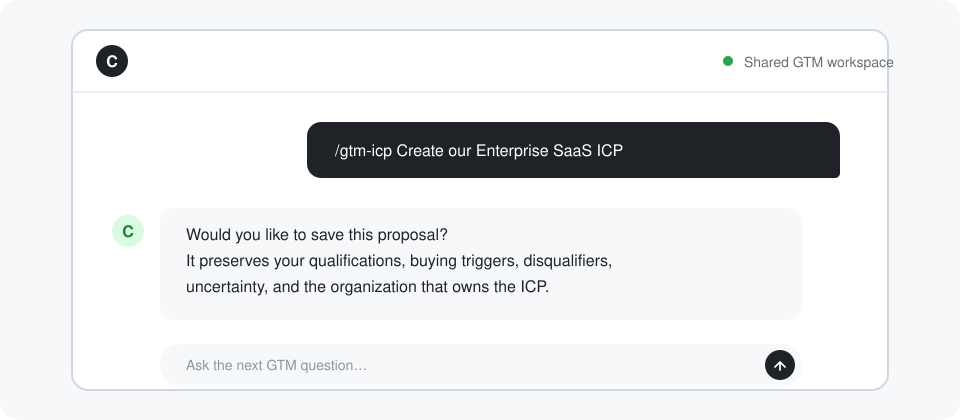

<h3 align="center">Build and maintain a shared GTM workspace</h3>

GTM Skills gives your team four open source Lifecycle SOPs for maintaining one Git-backed GTM workspace, its ICPs and personas, and the reusable workflows they support.

&nbsp;&nbsp;

✓&nbsp;100%&nbsp;free&nbsp;and&nbsp;open&nbsp;source &nbsp; ✓&nbsp;Four&nbsp;GTM&nbsp;skills,&nbsp;one&nbsp;install &nbsp; ✓&nbsp;Git-backed&nbsp;shared&nbsp;context

<small>⭐ Used by top GTM teams</small>

 

## Keep organization, market, buyer, and workflow knowledge in one place

The GTM workspace records durable facts about the business and its team. ICPs define the companies each organization serves, personas define the buyers and stakeholders it needs to understand, and saved workflows turn that context into repeatable work. Every durable change is previewed in full, accepted explicitly, and saved to history.

## Choose between repeated prompts, disconnected templates, custom agents, or one coherent foundation

| | **GTM Skills** | Repeated prompts | Standalone templates | Custom agents |
|---|:---:|:---:|:---:|:---:|
| **Four ready-made GTM skills** | ✅ | ❌ | ❌ | ❌ |
| **Shared Git-backed GTM workspace** | ✅ | ❌ | ❌ | ❌ |
| **Organization lifecycle management** | ✅ | ❌ | ❌ | ❌ |
| **ICP and persona lifecycle management** | ✅ | ❌ | ❌ | ❌ |
| **Local and Vercel workflow lifecycle management** | ✅ | ❌ | ❌ | ❌ |
| **Typed workflow result tables and migrations** | ✅ | ❌ | ❌ | ❌ |
| **Dry runs, checkpoints, approvals, schedules, and webhooks** | ✅ | ❌ | ❌ | ❌ |
| **Cached provider and model calls with a cost ledger** | ✅ | ❌ | ❌ | ❌ |
| **Node-local organization support** | ✅ | ❌ | ❌ | ❌ |
| **Review-before-write workflows** | ✅ | ❌ | ❌ | ❌ |

Keep durable GTM knowledge and reusable automations in one repository. Each SOP reads only the artifacts visible to the selected organization node and preserves accepted durable changes in history.

## Organize the business. Define the market. Describe the buyer. Run the work.

### 🏗️ Build the shared GTM workspace

Create or import an organization repository, add members and recursively nested suborganizations, update stored facts, and repair structural or Git problems.

### 📈 Define ideal customer profiles

Create, refine, delete, or doctor the ICPs that each organization or business unit owns, without routing into persona or account-workflow changes.

### 👥 Define buyer and stakeholder personas

Create, refine, delete, or doctor personas with clear responsibilities, influence, authority boundaries, disqualifiers, and open questions, without routing into ICP or lead-workflow changes.

### ⚙️ Build and run reusable GTM workflows

Create, update, inspect, delete, or run a saved workflow. Each workflow declares a typed result table, commits its database migrations, and upserts rows by a stable key. The same TypeScript file runs on your computer with a local SQLite database or on Vercel with Turso.

Before a real run, the agent reports rows, stages, projected cost, and caps without calling a provider or model. A checkpoint pauses the real run after the first saved rows so you can inspect them in Drizzle Studio and approve the rest of the same run. Provider and model calls share a cache and cost ledger, so unchanged reruns reuse prior results. Workflows can also wait for approval, run on a schedule, or resume from a per-run webhook.

## Build your GTM foundation in four steps

<table>
<tr>
<td align="center" valign="top" width="25%"><h3>1️⃣</h3><b>Install GTM Skills</b> Run <code>npx skills add eliasstravik/gtm-skills -g</code> to install all four skills.</td>
<td align="center" valign="top" width="25%"><h3>2️⃣</h3><b>Build your GTM workspace</b> Run <code>/gtm-workspace</code> to create or import the organization repository and add the members and business units it owns.</td>
<td align="center" valign="top" width="25%"><h3>3️⃣</h3><b>Define the market and buyer</b> Run <code>/gtm-icp</code> and <code>/gtm-persona</code> to create the definitions each organization needs.</td>
<td align="center" valign="top" width="25%"><h3>4️⃣</h3><b>Build your first workflow</b> Run <code>/gtm-workflow</code>, declare its table and caps, review a zero-spend dry run, then inspect the first saved rows at a checkpoint.</td>
</tr>
</table>

## Choose how to get started

<table>
<tr>
<td align="center" valign="top" width="50%"><h3>Self-serve</h3>For GTM builders and teams using AI agents <h2>Free</h2>
&nbsp;&nbsp;&nbsp;✓&nbsp; Four installable GTM skills &nbsp;&nbsp;&nbsp;✓&nbsp; Git-backed GTM workspace &nbsp;&nbsp;&nbsp;✓&nbsp; ICP lifecycle management &nbsp;&nbsp;&nbsp;✓&nbsp; Persona lifecycle management &nbsp;&nbsp;&nbsp;✓&nbsp; Local and Vercel workflows &nbsp;&nbsp;&nbsp;✓&nbsp; Guided previews, caps, and history
</td>
<td align="center" valign="top" width="50%"><h3>Done-with-you</h3>Hands-on setup and rollout for your GTM team <h2>Let's talk</h2>
&nbsp;&nbsp;&nbsp;✓&nbsp; Everything in self-serve &nbsp;&nbsp;&nbsp;✓&nbsp; Full GTM Skills setup &nbsp;&nbsp;&nbsp;✓&nbsp; GTM workspace repository configuration &nbsp;&nbsp;&nbsp;✓&nbsp; ICP, persona, and workflow design &nbsp;&nbsp;&nbsp;✓&nbsp; Team rollout, training, and best practices &nbsp;&nbsp;&nbsp;✓&nbsp; Ongoing maintenance and upgrades &nbsp;&nbsp;&nbsp;✓&nbsp; Dedicated Slack channel support
</td>
</tr>
<tr>
<td align="center"></td>
<td align="center"></td>
</tr>
</table>

## Get your questions answered

### Do I need to know how to code?

No code is required to run the guided skills. You need `npx`, an AI agent that loads installed skills, and Git for the GTM workspace repository.

### What gets installed?

The install command adds GTM Workspace, GTM ICP, GTM Persona, and GTM Workflow. Run `/gtm-workspace` first, use `/gtm-icp` and `/gtm-persona` for the definitions your organization owns, then use `/gtm-workflow` for reusable automations.

### What does GTM Workspace store?

It stores your organization’s durable self-knowledge: organization facts, members, suborganizations, ICPs, personas, and a root workflow project. The canonical root is `~/.gtm/<org-slug>/`; suborganizations use `suborgs/<suborg-slug>/`, member records use `members/<member-slug>/MEMBER.md`, and reusable workflow files live under root `workflows/workflows/`.

### Can different teams keep different ICPs and personas?

Yes. The root organization and its suborganizations can own their own definitions. Each authoring skill reads only the artifacts visible to the selected organization node.

### Where do workflows run?

You choose per workflow. Local workflows use a supported CLI agent and `data/gtm.db`. Vercel workflows use the same committed file, Turso, the optional Vercel CLI, and a Vercel AI Gateway key with a spending budget.

### What does it cost?

GTM Skills is free, open source, and MIT licensed. Your AI or model provider may charge for usage. Vercel execution is optional and uses the spending budget you set on its Gateway key.

## Install GTM Skills and build from shared truth

One repository holds what your team knows about the organization, its market, its buyers, and the workflows they rely on.

&nbsp;&nbsp;

✓&nbsp;100%&nbsp;free&nbsp;and&nbsp;open&nbsp;source &nbsp; ✓&nbsp;Four&nbsp;GTM&nbsp;skills,&nbsp;one&nbsp;install &nbsp; ✓&nbsp;Git-backed&nbsp;shared&nbsp;context

<small>⭐ Used by top GTM teams</small>

